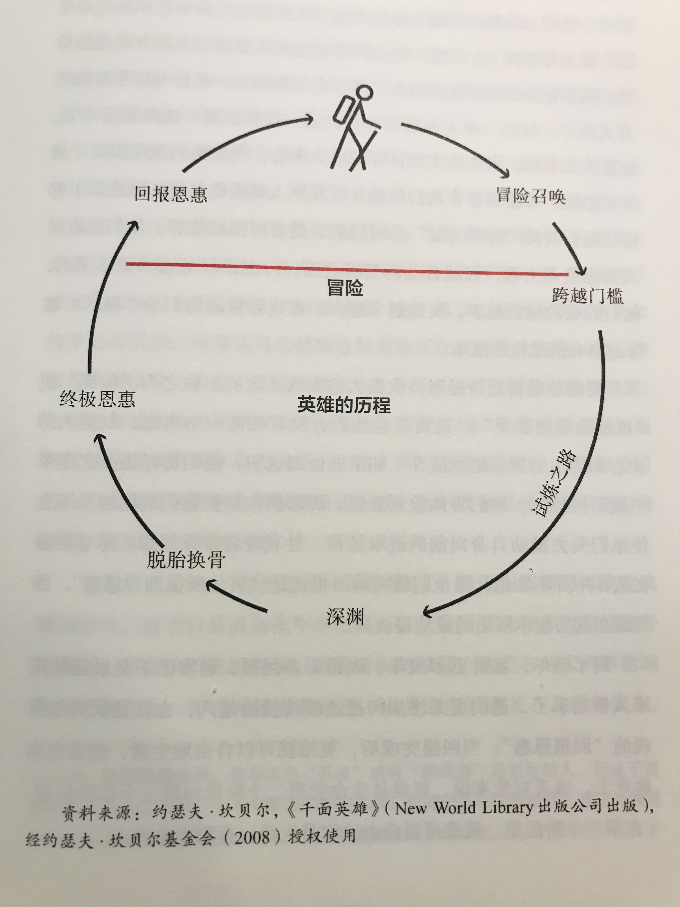

我知道，只要我基本的生活花费能够满足，我就会快乐。我的工作一直能把我带到各种充满异国情调的场所，让我遇到有意思的人。
没有+r+任何东西是可以确定+r+的，即使再看起来最安全的押注中也总是如此，所以+r+你最好总是假设自己没有看到全部+r+。
P23
+r+对我而言，有意义的工作是指一项我能全身心投入的使命；有意义的人际关系是指我既深深的关心对方，对方也深深的关心我。+r+
P23
当思考你真正想要的东西时，最好思考它们的相对价值，以便合理权衡。就我个人来说，我需要有意义的工作和有意义的人际关系，他们对我的重要性相等，而我对金钱的价值评价较低——只要我的钱足够满足我的基本需求就行了。
P34
“如果你已经+r+准备好放弃一切其他东西+r+，像医科学生研究解剖一样仔细地+r+研究+r+市场的整个历史和背景，并研究所有主要上市公司——如果你能做到上述的一切，同时你还拥有赌博者的+r+镇定+r+、洞察者的+r+第六感+r+和狮子的+r+勇气+r+，你才有可能抓住一丝机会。” —— 伯纳德·巴鲁克
P34
我离谱的过度自信，并放纵自己被情绪左右。我（再次）学到，无论我知道多少东西，无论我多么兴奋，我都不能自信地做出绝对的断言。
P35
回过头来看，+r+我的一败涂地是在我身上发生过最好的事情之一+r+，因为它让我变得谦逊，而我正需要谦逊平衡我的进攻性。我学到了一种很好的恐惧犯错意识，这把我的思维定势从认为“我是对的”变成了问自己+r+“我怎么知道我是对的”+r+。我清楚的看到，回答这个问题的最好方式是+r+找到其他的独立思考者，他们与我肩负共同的使命，但对问题的看法与我不同。+r+通过以一种经过深思熟虑的辩论方式与他们交流，我就能理解他们的推理，并让他们对我的推理进行压力测试。
P36
我学会了让自己保持极度开朗的心态，允许其他人+r+指出我可能疏忽的东西+r+。我发现，我能够成功的唯一途径将是：
  1. 找到与我观点不同的最聪明的人，以便能够努力理解他们的推理。
  2. +r+知道自己在什么时候不能有明确意见，不急于下结论+r+
  3. 逐步归纳+r+永恒和普适的原则+r+，对其进行测试，将其系统化。
  4. 通过平衡风险来保持较大的回报，并降低下行波动
P37
“那是一剂苦药，但我猜患者需要他。有时生活会给你当头一棒。不要失去信念。我确信推动我不断前行的唯一动力，是我喜欢做的事。” —— 乔布斯
P37
+r+想要追求卓越，你就必须挑战自己的极限+r+，虽然挑战极限可能回带来极大的失败，但是痛苦消散后，你将迎来更多的机会。
P41
在同时“思考”很多因素方面，计算机比我的大脑有效多了，而且计算机做起来更精确、更快、更不易受情绪干扰。并且，因为计算机的记忆力高潮，所以随着桥水发展，它能更好地把握的知识和同事的只是累积起来。我和合作伙伴不是就结论争论，二十九我们不同的决策标准进行争论。
P42
虽然计算机在很多能力方面比我们的大脑棒得多，但我们拥有的想象力、理解力和逻辑能力是它不具备的。
P49
如果你以勤奋和有创造性的方式工作，你几乎可以得到你想要的任何东西，但你不可能同时得到所有东西。 成熟意味着你可以+r+放弃一些好的选择，从而追求一些更好的选择+r+。
  > 在这样的情况持续了约一年之后，我明白同时运作桥水和“桥水中国合作伙伴”是不可能的，所以我关闭了这家公司。没有人赚钱也没有人赔钱，只是因为我对我看到的情况不放心，不足以让我做出任何投资决策。我相信我如果全部时间都用到这方面的话，我们会取得很大的成功，但那样的话，桥水也不会是今天的样子。尽管我错过了这个好机会，但我并不后悔我的决定。	
P51
+r+我喜欢在有趣的地方认识有趣的人，并通过他们的眼睛看世界+r+。不管他们是富是穷，这样都有益处。
  > 我在巴布亚新几内亚认识了那里的土著人，对我而言，学习从他们的视角看待生活，与从全球政治积极领导人、改变世界的企业家和最优秀的科学家那里学习看问题的视角具有同样的启发作用。我永远忘不了我们在叙利亚的一座清真寺里遇到的那位盲眼圣哲，他向我解释了《古兰经》，以及他和真主的联系。
  > 类似这样的邂逅让我明白，+r+人类的伟大和不同凡响不取决于财富或者其他世俗的成功标准+r+。我还明白，+r+在没有真正通过别人的视角看待事物之前就对别人下判断，会妨碍对他们所处环境的了解，而且这样做很不明智。+r+
  > +r+我建议你保持足够的好奇心，始终愿意去理解额那些看问题与你不一样的人是怎么形成看问题的方式的+r+。你将会发现这很有趣，而且益处无穷，而你获得的更丰富的视角将帮助你决定你应当怎么做。
P53
对我来说，有意义的人际关系是指r+开放诚恳的关系，人们彼此坦诚相待+r+。我从来都不看重更传统的，冷冰冰的人际关系，人们只是摆出一副礼貌的面孔，不说出心里真实的想法。
P54
我说话很坦诚，也希望周围的人说话坦诚。+r+我为追求我觉得最好的东西而奋斗，而我希望他们也一样+r+。当我觉得谁做了什么蠢事时，我会直说，同时我也希望他们+r+在我干了蠢事时直言相告+r+。这样做将让我们所有人获益。在我看来，强大而富有创造力的人际关系就是这个样子的。以任何其他方式运行的组织都将是低效的。
P55
所有了不起的投资者和和投资策略都是有弱点的。在弱点呈现时就对其失去信心时一种常见错误，就像在其有效时过于迷恋一样。因为大多数人都有情绪化倾向，不会严格遵守逻辑，所以他们通常会对短期结果反应过度：情况不好使他们放弃，并以过低价格脱手；好的时候他们有以过高的价格买进。我发现这个道理不仅对投资适用，对人和事物的关系同样适用：+r+明智的人在经历各种沉浮时都是中盯紧稳健的基本面；而轻浮的人跟着感觉走，做出情绪化反应，对于热门的东西一拥而上，不热的时候又马上放弃。+r+
P61
想要拥有很多优势，而又不暴露于不可接受的劣势之下，最稳妥的方式是做出一系列良好的、互不相关的押注，彼此平衡，相互补充。
P65
但面对两种你都需要但看起来矛盾的选择时，你需要耐心思考如何尽最大可能兼顾二者。几乎总有一条道路时存在但你还没有找到的，所以你应该努力寻找直到找到，而不是凑合着接受那个看起来明显的选择。
P75
没有了透明性，人们会曲解各种事情，使之符合自身利益，有时甚至会秘密的这样做。+r+问题会被各种隐藏，而不是被摆上桌面、得到解决。+r+（作者的解决方式是，通过剪辑后的会议录音，集中选出最重要的片段，而且我们逐步增加问题，从而制作可用于培训的“虚拟现实”案例研究。）
P79
这段走出地狱的历程，让我对人们看待事物时如何不同以及为什么会产生这些不同，有更深刻的理解。我了解到，+r+我们的思维方式很大程度上是由心理因素决定的，是可以改变的。+r+
P79
富有创造性的天才和疯子可能只有一步之隔，能给人带来洞察力的化学反应也能造成扭曲，而一个人被自己的大脑困住是件极其危险的事情。
P89
我开始认识到大多数人有一定的情绪障碍，不愿坦率地面对自身的问题和弱点。他们不愿直面扑朔迷离的形势和艰难的挑战，在遇到这些情况时，人们通常会觉得不舒服。兼具尝试、创造性和主动寻求改变等个性的人，简直是凤毛麟角。
P97
结果是他们有很多共性。他们都是+r+独立的思考者+r+，+r+不会让任何东西或者任何人妨碍自己追求大胆的目标+r+。+r+对于事情应该怎么做，他们在头脑里都有十分坚定的规划+r+，同时又始终愿意在现实中检验这些头脑规划、调整做法，从而使规划效果变得更好。他们都极为+r+坚韧+r+，因为相对于他们在追求梦想的过程中经历的痛苦而言，他们实现梦想的决心更为强烈。也许最有意思的是，+r+他们关于未来的视野要比多数人宽广+r+，或者他们自己就有这样的视野，或者他们善于从能看到更多东西的人那里学习。他们都能同时看到大图景和小细节（以及中间层次），+r+并能综合在不同层次上总结的观点，而大多数人是见此不见彼。+r+创造性、系统性、实现性在他们身上合而为一。他们既是坚决的又是开明的。最重要的是，+r+他们对自己的事业充满热情+r+，对表现一般的手下不能容忍，同时想给世界带来+r+巨大、有益的影响+r+。
P108
大多数人没有与本国及他国领导层直接打过交道，+r+他们基于从媒体了解到到的情况形成自己的观点，因而变得非常天真，并持有不合理的偏执观点。**这是因为与冷静客观的分析相比，戏剧化的故事和传言能够喜迎跟多的读者和观众。**+r+而且，在一些情况下，“新闻工作者”也有自己的意识形态需要推动。因此，大多数通过媒体棱镜看世界的人喜欢区分好人和坏人，而不是看各方的既得利益和相对权势，以及这些因素如何相互作用。例如，如果报道告诉人们本国是多么道德，敌国是多么不道德，人们就倾向于接受，而大多数时候这些国家只不过利益不同，并努力将其利益最大化。 
P110
在坎贝尔看来，“英雄”是一个完美的、总会把事做对的人。远不止如此，英雄的特征是能“在常规的成就范畴之外发现、实现（或做到）一些事情”，并“把生命奉献给高于自身或自身之外的东西”。我一生遇到了很多这样的人。坎贝尔的著作最有意思的部分是讲述英雄如何走上这条道路。英雄并不一开始就是英雄，他们是通过一系列环环相扣的步骤成为英雄的。

他们通常最初在一个平凡的世界过着平凡的生活，然后被一个“冒险召唤”感召。这引导他们走上一条“试炼之路”，充满了战斗、诱惑、胜利和失败。一路上他们得到别人的帮助，通常是那些走得更远的、成为导师的人，尽管一些走得不够远的人也能以不同方式提供帮助。他们还会遇到盟友和敌人，并学会如何战斗，通常是以非常规的方式战斗。他们一路上会遇到各种诱惑，并和长辈、晚辈发生冲突，也会实现和解。因为有实现目标的伟大决心，所以他们能克服对于战斗的恐惧。考验和教育他们的战斗以及别人赠送的礼物（如建议）都能让他们获得“特殊力量”（即技能）。随着时间的推移，他们既取得成功也遭遇失败，但随着他们变强，持之以恒地追求更多东西，他们的成功也越来越多，失败越来越少，而这会带个他们越来越大、越来越具有挑战性的战斗。
英雄总是会经历一次极大的失败（坎贝尔称之为“深渊”或“被鲸鱼吃进肚子”），这将考验他们有没有韧性东山再起，以更大的巨型和更多的智慧继续战斗。如果能做到这些，他们将经历一次变革（“脱胎换骨”）。他们将体验到恐惧，而恐惧在保护他们的同时又不会使他们失去推动自身向前的进取精神。胜利终将带来回报。尽管英雄在战斗中并不知道，但他们最大的回报就是坎贝尔所说的“恩惠”，即英雄在其历程中悟出的成功秘诀。
到了晚年，赢得更多战斗、取得更多回报，通常已不是最能让英雄兴奋的事了，他们更关注如何把经验传授给他人，也就是坎贝尔所说的“回报恩惠”。当回报完成后，英雄就可以自由地生活，然后自由的死去，或者对我来说，就是从生命的第二个阶段向第三个阶段转型。
P118
一个社区，在这里，你们始终既有权利也有义务去理解事物；一个进程，+r+让你们在分歧中进步+r+，即真正的、运转良好的创意择优。+r+我希望你们思考而不是跟从，同时要认识到自己可能是错的，自己也有缺点+r+；我希望帮助你们尽可能得到最好的答案，尽管你们可能并不相信这是最好的答案。+r+我想给你们极度开放的头脑和创意择优，这将让你们不会师心自用，而是接触世界上最明智的人+r+，以帮助你们为自己、为社会做出最好的决定。我想帮助你们所有人好好拼搏，不断进步，实现生命的最大价值。
P124
同样的事情反复发生，我开始把+r+现实视为一部华丽的永动机，一些原因引起一些结果，这些结果又成为原因，循环往复+r+。
我逐渐领悟到，在如此伟大的系统里，我不过是渺小的匆匆过客，因此知道如何与这个系统良好互动，对我和系统都是有益的。
P124
体验痛苦，然后探索大自然希望通过痛苦给我什么教益，开始成为我的一项游戏。这项游戏我做的越多就越擅长，也就越不会对这些情况感到痛苦，同时思考、总结出原则、利用原则获得回报的过程也变得越来越有收获。
P125
由于所有这些拼搏与学习，我已经做了自己想做的一切事，去了自己想去的一切地方，遇到了自己想遇到的一切人，得到了自己想拥有的一切，经历了一段迷人的职业生涯，而最有收获的是，建立了许多美妙的人际关系。我经历了生活中的一切，从一文不名到财富不菲，从籍籍无名到功成名就，所以我知道其中的差别。我的判断是，拥有很多东西、身处顶层的人，得到的边际收益并不像多数人认为的那么大。+r+拥有最基本的东西，如一张舒适的床、良好的人际关系、美食、美好的性生活等，是最重要的，而这些东西并不会因你拥有金钱的多寡而发生明显变化。你在顶层遇到的人并不一定比在中下层遇到的更特殊。+r+
P